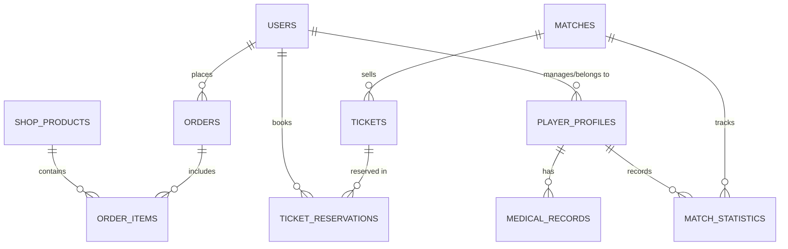

## 2. Entity Relationship Diagram

```mermaid
erDiagram
    USERS ||--o{ ORDERS : "places"
    USERS ||--o{ TICKET_RESERVATIONS : "books"
    USERS ||--o{ PLAYER_PROFILES : "manages/belongs to"

    SHOP_PRODUCTS ||--o{ ORDER_ITEMS : "contains"
    ORDERS ||--o{ ORDER_ITEMS : "includes"

    MATCHES ||--o{ TICKETS : "sells"
    TICKETS ||--o{ TICKET_RESERVATIONS : "reserved in"

    PLAYER_PROFILES ||--o{ MEDICAL_RECORDS : "has"
    PLAYER_PROFILES ||--o{ MATCH_STATISTICS : "records"
    MATCHES ||--o{ MATCH_STATISTICS : "tracks"
```

---
