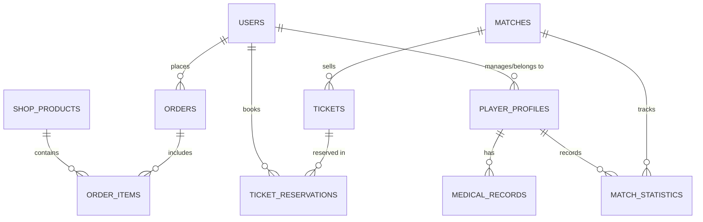

# X-Streme Database Design

## 1. Overview
The proposed MVP persistence layer for the **X-Streme** football platform uses **PostgreSQL 12+** for relational data and private object storage for media assets (product images, medical attachments, stream media). It supports unified account management, sports merchandise catalog & order processing, squad roster management, HIPAA/GDPR-compliant medical records, match ticketing, and live match streaming statistics without storing large binary media files directly in the database.

This is a logical database design. The exact PostgreSQL version, identity provider, object storage platform, migration framework, hosting region, and compliance retention periods remain implementation decisions.

---

## 2. Design Principles
* Every user-owned aggregate is anchored to `users.user_id` and authorized server-side.
* Images and stream media live in private object storage; only non-guessable object keys and metadata are stored in PostgreSQL.
* Controlled vocabularies use lookup constraints where product-managed values may change.
* Soft archive is supported for inventory and profile items; permanent deletion is a separate confirmed operation.
* Timestamps use `timestamptz` and are written in UTC.
* Primary keys use UUIDs (`uuid_generate_v4()`) to avoid exposing sequential identifiers.

---

## 3. Entity Relationship Diagram



---

## 4. Tables

### 4.1 Identity, Authentication & Subscriptions

**users**
| Column | Type | Constraints / Notes |
| :--- | :--- | :--- |
| `user_id` | `uuid` | Primary Key, default `uuid_generate_v4()`. |
| `email_normalized` | `varchar(320)` | Not Null, Unique; case-normalized. |
| `password_hash` | `text` | Not Null; never store plain passwords. |
| `role` | `varchar(20)` | Not Null; check in (`admin`, `manager`, `medical`, `player`, `customer`). |
| `subscription_tier` | `varchar(20)` | Not Null, default `'free'`; check in (`free`, `premium`, `pro`). |
| `is_active` | `boolean` | Not Null, default `true`. |
| `created_at` | `timestamptz` | Not Null, default `current_timestamp`. |
| `updated_at` | `timestamptz` | Not Null, default `current_timestamp`. |

**user_profiles**
| Column | Type | Constraints / Notes |
| :--- | :--- | :--- |
| `user_id` | `uuid` | Primary Key, foreign key to `users(user_id)` with cascade delete. |
| `first_name` | `varchar(80)` | Not Null. |
| `last_name` | `varchar(80)` | Not Null. |
| `phone_number` | `varchar(30)` | Nullable. |
| `preferred_language` | `varchar(10)` | Not Null, default `'en'`. |
| `avatar_object_key` | `text` | Nullable; private object-storage key. |
| `updated_at` | `timestamptz` | Not Null, default `current_timestamp`. |

---

### 4.2 STM Merchandise Shop

**shop_products**
| Column | Type | Constraints / Notes |
| :--- | :--- | :--- |
| `product_id` | `uuid` | Primary Key, default `uuid_generate_v4()`. |
| `sku` | `varchar(50)` | Not Null, Unique. |
| `name` | `varchar(120)` | Not Null. |
| `description` | `text` | Nullable. |
| `category` | `varchar(50)` | Not Null; e.g., `kits`, `apparel`, `accessories`. |
| `price` | `numeric(10,2)` | Not Null; check greater than 0. |
| `stock_quantity` | `integer` | Not Null, default 0; check non-negative. |
| `image_object_key` | `text` | Not Null; private object-storage key. |
| `is_active` | `boolean` | Not Null, default `true`. |
| `created_at` | `timestamptz` | Not Null, default `current_timestamp`. |

**orders**
| Column | Type | Constraints / Notes |
| :--- | :--- | :--- |
| `order_id` | `uuid` | Primary Key, default `uuid_generate_v4()`. |
| `user_id` | `uuid` | Not Null, foreign key to `users(user_id)`. |
| `order_status` | `varchar(20)` | Not Null; check in (`pending`, `paid`, `shipped`, `cancelled`). |
| `total_amount` | `numeric(10,2)` | Not Null; check non-negative. |
| `shipping_address` | `text` | Not Null. |
| `created_at` | `timestamptz` | Not Null, default `current_timestamp`. |

**order_items**
| Column | Type | Constraints / Notes |
| :--- | :--- | :--- |
| `order_id` | `uuid` | Foreign key to `orders(order_id)` with cascade delete. |
| `product_id` | `uuid` | Foreign key to `shop_products(product_id)`. |
| `unit_price` | `numeric(10,2)` | Not Null; historical snapshot price. |
| `quantity` | `integer` | Not Null; check greater than 0. |
| Primary key: `(order_id, product_id)`. |

---

### 4.3 PitchMaster FTMS (Roster & Medical)

**player_profiles**
| Column | Type | Constraints / Notes |
| :--- | :--- | :--- |
| `player_id` | `uuid` | Primary Key, default `uuid_generate_v4()`. |
| `user_id` | `uuid` | Nullable, foreign key to `users(user_id)` with set null on delete. |
| `jersey_number` | `smallint` | Not Null; check from 1 to 99. |
| `position` | `varchar(30)` | Not Null; e.g., `GK`, `CB`, `CM`, `ST`. |
| `preferred_foot` | `varchar(10)` | Check in (`left`, `right`, `both`). |
| `availability_status`| `varchar(20)` | Not Null, default `'Fit'`; check in (`Fit`, `Doubtful`, `Injured`). |
| `created_at` | `timestamptz` | Not Null, default `current_timestamp`. |

**medical_records**
| Column | Type | Constraints / Notes |
| :--- | :--- | :--- |
| `record_id` | `uuid` | Primary Key, default `uuid_generate_v4()`. |
| `player_id` | `uuid` | Not Null, foreign key to `player_profiles(player_id)` with cascade delete. |
| `diagnosis` | `text` | Not Null. |
| `treatment_plan` | `text` | Nullable. |
| `estimated_return_date`| `date` | Nullable. |
| `confidentiality_level`| `varchar(20)`| Not Null, default `'HIPAA_STRICT'`. |
| `created_at` | `timestamptz` | Not Null, default `current_timestamp`. |

---

### 4.4 X-Stream Live Streaming & Ticketing

**matches**
| Column | Type | Constraints / Notes |
| :--- | :--- | :--- |
| `match_id` | `uuid` | Primary Key, default `uuid_generate_v4()`. |
| `home_team` | `varchar(80)` | Not Null. |
| `away_team` | `varchar(80)` | Not Null. |
| `kickoff_time` | `timestamptz` | Not Null. |
| `venue` | `varchar(120)` | Not Null. |
| `stream_url_hls` | `text` | Nullable; multi-language streaming endpoint. |
| `status` | `varchar(20)` | Check in (`scheduled`, `live`, `completed`). |

**tickets**
| Column | Type | Constraints / Notes |
| :--- | :--- | :--- |
| `ticket_id` | `uuid` | Primary Key, default `uuid_generate_v4()`. |
| `match_id` | `uuid` | Not Null, foreign key to `matches(match_id)` with cascade delete. |
| `seat_section` | `varchar(30)` | Not Null. |
| `price` | `numeric(10,2)` | Not Null; check non-negative. |
| `available_quantity`| `integer` | Not Null; check non-negative. |

**ticket_reservations**
| Column | Type | Constraints / Notes |
| :--- | :--- | :--- |
| `reservation_id` | `uuid` | Primary Key, default `uuid_generate_v4()`. |
| `user_id` | `uuid` | Not Null, foreign key to `users(user_id)` with cascade delete. |
| `ticket_id` | `uuid` | Not Null, foreign key to `tickets(ticket_id)` with cascade delete. |
| `reserved_at` | `timestamptz` | Not Null, default `current_timestamp`. |

**match_statistics**
| Column | Type | Constraints / Notes |
| :--- | :--- | :--- |
| `match_id` | `uuid` | Foreign key to `matches(match_id)` with cascade delete. |
| `player_id` | `uuid` | Foreign key to `player_profiles(player_id)` with cascade delete. |
| `goals` | `smallint` | Not Null, default 0; check non-negative. |
| `assists` | `smallint` | Not Null, default 0; check non-negative. |
| `minutes_played` | `smallint` | Not Null, default 0; check non-negative. |
| Primary key: `(match_id, player_id)`. |

---

## 5. Referencing Schema Definition (PostgreSQL)

```sql
CREATE EXTENSION IF NOT EXISTS "uuid-ossp";

-- 5.1 Identity, Authentication & Subscriptions
CREATE TABLE users (
    user_id UUID PRIMARY KEY DEFAULT uuid_generate_v4(),
    email_normalized VARCHAR(320) NOT NULL UNIQUE,
    password_hash TEXT NOT NULL,
    role VARCHAR(20) NOT NULL CHECK (role IN ('admin', 'manager', 'medical', 'player', 'customer')),
    subscription_tier VARCHAR(20) NOT NULL DEFAULT 'free' CHECK (subscription_tier IN ('free', 'premium', 'pro')),
    is_active BOOLEAN NOT NULL DEFAULT TRUE,
    created_at TIMESTAMPTZ NOT NULL DEFAULT CURRENT_TIMESTAMP,
    updated_at TIMESTAMPTZ NOT NULL DEFAULT CURRENT_TIMESTAMP
);

CREATE TABLE user_profiles (
    user_id UUID PRIMARY KEY REFERENCES users(user_id) ON DELETE CASCADE,
    first_name VARCHAR(80) NOT NULL,
    last_name VARCHAR(80) NOT NULL,
    phone_number VARCHAR(30),
    preferred_language VARCHAR(10) NOT NULL DEFAULT 'en',
    avatar_object_key TEXT,
    updated_at TIMESTAMPTZ NOT NULL DEFAULT CURRENT_TIMESTAMP
);

-- 5.2 STM Merchandise Shop
CREATE TABLE shop_products (
    product_id UUID PRIMARY KEY DEFAULT uuid_generate_v4(),
    sku VARCHAR(50) NOT NULL UNIQUE,
    name VARCHAR(120) NOT NULL,
    description TEXT,
    category VARCHAR(50) NOT NULL,
    price NUMERIC(10, 2) NOT NULL CHECK (price > 0),
    stock_quantity INTEGER NOT NULL DEFAULT 0 CHECK (stock_quantity >= 0),
    image_object_key TEXT NOT NULL,
    is_active BOOLEAN NOT NULL DEFAULT TRUE,
    created_at TIMESTAMPTZ NOT NULL DEFAULT CURRENT_TIMESTAMP
);

CREATE TABLE orders (
    order_id UUID PRIMARY KEY DEFAULT uuid_generate_v4(),
    user_id UUID NOT NULL REFERENCES users(user_id),
    order_status VARCHAR(20) NOT NULL CHECK (order_status IN ('pending', 'paid', 'shipped', 'cancelled')),
    total_amount NUMERIC(10, 2) NOT NULL CHECK (total_amount >= 0),
    shipping_address TEXT NOT NULL,
    created_at TIMESTAMPTZ NOT NULL DEFAULT CURRENT_TIMESTAMP
);

CREATE TABLE order_items (
    order_id UUID REFERENCES orders(order_id) ON DELETE CASCADE,
    product_id UUID REFERENCES shop_products(product_id),
    unit_price NUMERIC(10, 2) NOT NULL CHECK (unit_price >= 0),
    quantity INTEGER NOT NULL CHECK (quantity > 0),
    PRIMARY KEY (order_id, product_id)
);

-- 5.3 PitchMaster FTMS (Roster & Medical)
CREATE TABLE player_profiles (
    player_id UUID PRIMARY KEY DEFAULT uuid_generate_v4(),
    user_id UUID REFERENCES users(user_id) ON DELETE SET NULL,
    jersey_number SMALLINT NOT NULL CHECK (jersey_number BETWEEN 1 AND 99),
    position VARCHAR(30) NOT NULL,
    preferred_foot VARCHAR(10) CHECK (preferred_foot IN ('left', 'right', 'both')),
    availability_status VARCHAR(20) NOT NULL DEFAULT 'Fit' CHECK (availability_status IN ('Fit', 'Doubtful', 'Injured')),
    created_at TIMESTAMPTZ NOT NULL DEFAULT CURRENT_TIMESTAMP
);

CREATE TABLE medical_records (
    record_id UUID PRIMARY KEY DEFAULT uuid_generate_v4(),
    player_id UUID NOT NULL REFERENCES player_profiles(player_id) ON DELETE CASCADE,
    diagnosis TEXT NOT NULL,
    treatment_plan TEXT,
    estimated_return_date DATE,
    confidentiality_level VARCHAR(20) NOT NULL DEFAULT 'HIPAA_STRICT',
    created_at TIMESTAMPTZ NOT NULL DEFAULT CURRENT_TIMESTAMP
);

-- 5.4 X-Stream Live Streaming & Ticketing
CREATE TABLE matches (
    match_id UUID PRIMARY KEY DEFAULT uuid_generate_v4(),
    home_team VARCHAR(80) NOT NULL,
    away_team VARCHAR(80) NOT NULL,
    kickoff_time TIMESTAMPTZ NOT NULL,
    venue VARCHAR(120) NOT NULL,
    stream_url_hls TEXT,
    status VARCHAR(20) CHECK (status IN ('scheduled', 'live', 'completed'))
);

CREATE TABLE tickets (
    ticket_id UUID PRIMARY KEY DEFAULT uuid_generate_v4(),
    match_id UUID NOT NULL REFERENCES matches(match_id) ON DELETE CASCADE,
    seat_section VARCHAR(30) NOT NULL,
    price NUMERIC(10, 2) NOT NULL CHECK (price >= 0),
    available_quantity INTEGER NOT NULL CHECK (available_quantity >= 0)
);

CREATE TABLE ticket_reservations (
    reservation_id UUID PRIMARY KEY DEFAULT uuid_generate_v4(),
    user_id UUID NOT NULL REFERENCES users(user_id) ON DELETE CASCADE,
    ticket_id UUID NOT NULL REFERENCES tickets(ticket_id) ON DELETE CASCADE,
    reserved_at TIMESTAMPTZ NOT NULL DEFAULT CURRENT_TIMESTAMP
);

CREATE TABLE match_statistics (
    match_id UUID REFERENCES matches(match_id) ON DELETE CASCADE,
    player_id UUID REFERENCES player_profiles(player_id) ON DELETE CASCADE,
    goals SMALLINT NOT NULL DEFAULT 0 CHECK (goals >= 0),
    assists SMALLINT NOT NULL DEFAULT 0 CHECK (assists >= 0),
    minutes_played SMALLINT NOT NULL DEFAULT 0 CHECK (minutes_played >= 0),
    PRIMARY KEY (match_id, player_id)
);
```

---

## 6. Referential Actions and Deletion Policy
* Deleting a user cascades to profile records and ticket reservations.
* Product deletion should soft-archive (`is_active = false`) to preserve order history.
* Player profile deletion sets `user_id` to `NULL` or archives associated records safely.

---

## 7. Security and Privacy Controls
* Restrict access to sensitive tables like `medical_records` using application-level RBAC and database privileges.
* Parameterize all backend queries to protect against SQL injection.
* Store image and media files externally, referencing them via unique object storage keys.
```
