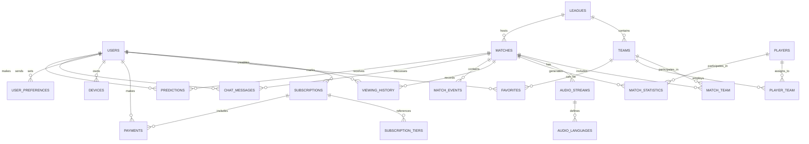

# Database Design: OmniPitch

## Document Information

**Project Name:** OmniPitch  
**Document Type:** Database Design & Schema Specification  
**Version:** 1.0  
**Date Created:** September 1, 2026  
**Status:** Active  
**Database Engine:** PostgreSQL 12+

---

## 1. Introduction

This document defines the complete database schema for the OmniPitch streaming platform. It includes detailed table specifications, data types, constraints, relationships, and an entity-relationship diagram (ERD) illustrating the platform's data architecture.

### 1.1 Design Principles

- **Normalization:** Database follows 3NF (Third Normal Form) to minimize data redundancy
- **Scalability:** Schema supports horizontal scaling and archival strategies
- **Performance:** Indexes designed for common query patterns
- **Data Integrity:** Constraints ensure referential integrity and business rule enforcement
- **Compliance:** GDPR considerations for personal data retention and deletion

### 1.2 Technology Stack

- **Primary Database:** PostgreSQL 12+
- **Caching Layer:** Redis (for sessions and frequently accessed data)
- **Archive Storage:** AWS S3 or equivalent (for video content metadata)
- **Backup Strategy:** Daily incremental backups with monthly full backups

---

## 2. Entity-Relationship Diagram (ERD)



---

## 3. Core Tables

### 3.1 Users Table

**Purpose:** Store all user account information and authentication credentials

```sql
CREATE TABLE users (
    user_id BIGSERIAL PRIMARY KEY,
    email VARCHAR(255) NOT NULL UNIQUE,
    username VARCHAR(100) NOT NULL UNIQUE,
    password_hash VARCHAR(255) NOT NULL,
    full_name VARCHAR(255) NOT NULL,
    phone_number VARCHAR(20),
    date_of_birth DATE,
    country_code VARCHAR(2),
    preferred_language VARCHAR(10) DEFAULT 'en',
    profile_picture_url VARCHAR(500),
    bio TEXT,
    is_email_verified BOOLEAN DEFAULT FALSE,
    is_active BOOLEAN DEFAULT TRUE,
    account_status VARCHAR(50) DEFAULT 'active', -- active, suspended, banned, deleted
    two_factor_enabled BOOLEAN DEFAULT FALSE,
    created_at TIMESTAMP DEFAULT CURRENT_TIMESTAMP,
    updated_at TIMESTAMP DEFAULT CURRENT_TIMESTAMP,
    last_login_at TIMESTAMP,
    deleted_at TIMESTAMP,
    
    CONSTRAINT email_format CHECK (email LIKE '%@%.%'),
    CONSTRAINT username_length CHECK (LENGTH(username) >= 3),
    INDEX idx_email (email),
    INDEX idx_username (username),
    INDEX idx_country_code (country_code),
    INDEX idx_created_at (created_at)
);
```

**Table Description:**
- Stores complete user profile information
- `email` and `username` are globally unique
- `password_hash` stores bcrypt-hashed passwords (never plaintext)
- `account_status` tracks user lifecycle (active, suspended, banned)
- Soft deletes use `deleted_at` for GDPR compliance
- Indexed for fast lookup by email, username, and registration date

---

### 3.2 Subscriptions Table

**Purpose:** Track user subscription status, tier, and billing cycle

```sql
CREATE TABLE subscriptions (
    subscription_id BIGSERIAL PRIMARY KEY,
    user_id BIGINT NOT NULL,
    subscription_tier_id BIGINT NOT NULL,
    billing_cycle VARCHAR(20) NOT NULL, -- monthly, annual
    status VARCHAR(50) NOT NULL, -- active, paused, cancelled, expired
    start_date DATE NOT NULL,
    end_date DATE,
    renewal_date DATE NOT NULL,
    auto_renew BOOLEAN DEFAULT TRUE,
    cancellation_date TIMESTAMP,
    cancellation_reason TEXT,
    pause_until TIMESTAMP,
    created_at TIMESTAMP DEFAULT CURRENT_TIMESTAMP,
    updated_at TIMESTAMP DEFAULT CURRENT_TIMESTAMP,
    
    FOREIGN KEY (user_id) REFERENCES users(user_id) ON DELETE CASCADE,
    FOREIGN KEY (subscription_tier_id) REFERENCES subscription_tiers(tier_id),
    CONSTRAINT valid_dates CHECK (start_date < end_date OR end_date IS NULL),
    INDEX idx_user_id (user_id),
    INDEX idx_status (status),
    INDEX idx_renewal_date (renewal_date),
    INDEX idx_start_date (start_date)
);
```

**Table Description:**
- Tracks subscription lifecycle per user
- `status` indicates current subscription state
- `auto_renew` controls automatic renewal
- `pause_until` enables subscription pausing
- Linked to `subscription_tiers` for tier details
- Indexed by user_id for quick subscription lookup

---

### 3.3 Subscription Tiers Table

**Purpose:** Define available subscription plans and their features

```sql
CREATE TABLE subscription_tiers (
    tier_id BIGSERIAL PRIMARY KEY,
    tier_name VARCHAR(100) NOT NULL UNIQUE, -- Free, Premium, Pro
    monthly_price DECIMAL(10, 2),
    annual_price DECIMAL(10, 2),
    currency VARCHAR(3) DEFAULT 'EUR',
    max_video_quality VARCHAR(50) NOT NULL, -- 720p, 1080p, 4K
    max_concurrent_streams INT NOT NULL,
    matches_per_month INT, -- NULL = unlimited
    available_languages INT NOT NULL,
    includes_ads BOOLEAN DEFAULT TRUE,
    hd_streaming BOOLEAN DEFAULT FALSE,
    advanced_stats BOOLEAN DEFAULT FALSE,
    custom_playlists BOOLEAN DEFAULT FALSE,
    offline_downloads BOOLEAN DEFAULT FALSE,
    description TEXT,
    is_active BOOLEAN DEFAULT TRUE,
    created_at TIMESTAMP DEFAULT CURRENT_TIMESTAMP,
    updated_at TIMESTAMP DEFAULT CURRENT_TIMESTAMP,
    
    CONSTRAINT positive_price CHECK (monthly_price > 0 OR monthly_price IS NULL),
    INDEX idx_tier_name (tier_name)
);
```

**Table Description:**
- Defines each subscription tier (Free, Premium, Pro)
- Stores pricing in EUR, extensible to other currencies
- Features controlled by boolean flags
- `matches_per_month` set to NULL for unlimited
- Easy tier modification without affecting user subscriptions

---

### 3.4 Leagues Table

**Purpose:** Store European football league information

```sql
CREATE TABLE leagues (
    league_id BIGSERIAL PRIMARY KEY,
    league_name VARCHAR(255) NOT NULL UNIQUE, -- Premier League, La Liga, etc.
    country VARCHAR(100) NOT NULL,
    country_code VARCHAR(2) NOT NULL,
    logo_url VARCHAR(500),
    founded_year INT,
    total_teams INT,
    matches_per_season INT,
    tier INT, -- 1 for top division, 2 for second division, etc.
    is_active BOOLEAN DEFAULT TRUE,
    created_at TIMESTAMP DEFAULT CURRENT_TIMESTAMP,
    updated_at TIMESTAMP DEFAULT CURRENT_TIMESTAMP,
    
    CONSTRAINT valid_year CHECK (founded_year > 1850 AND founded_year <= YEAR(CURRENT_DATE)),
    INDEX idx_league_name (league_name),
    INDEX idx_country_code (country_code),
    INDEX idx_tier (tier)
);
```

**Table Description:**
- Stores metadata for each European football league
- `country_code` enables region-based filtering
- `tier` distinguishes between top divisions (tier 1) and others
- `is_active` allows soft deletion of archived leagues
- Supports 5 major leagues: Premier League, La Liga, Bundesliga, Serie A, Ligue 1

---

### 3.5 Teams Table

**Purpose:** Store team information within leagues

```sql
CREATE TABLE teams (
    team_id BIGSERIAL PRIMARY KEY,
    league_id BIGINT NOT NULL,
    team_name VARCHAR(255) NOT NULL,
    team_code VARCHAR(10), -- Short code (e.g., MAN, LIV)
    city VARCHAR(100),
    stadium_name VARCHAR(255),
    founded_year INT,
    logo_url VARCHAR(500),
    team_colors VARCHAR(100), -- e.g., "red,white"
    website_url VARCHAR(500),
    total_players INT,
    manager_name VARCHAR(255),
    is_active BOOLEAN DEFAULT TRUE,
    created_at TIMESTAMP DEFAULT CURRENT_TIMESTAMP,
    updated_at TIMESTAMP DEFAULT CURRENT_TIMESTAMP,
    
    FOREIGN KEY (league_id) REFERENCES leagues(league_id) ON DELETE CASCADE,
    UNIQUE(league_id, team_code),
    CONSTRAINT valid_founded CHECK (founded_year > 1800 AND founded_year <= YEAR(CURRENT_DATE)),
    INDEX idx_league_id (league_id),
    INDEX idx_team_name (team_name),
    INDEX idx_team_code (team_code)
);
```

**Table Description:**
- Stores team profiles within each league
- `team_code` enables quick identification (e.g., MAN for Manchester United)
- `stadium_name` and `city` for match context
- `manager_name` for current team management info
- Indexed for team searches and league filtering

---

### 3.6 Matches Table

**Purpose:** Store match/game information and streaming details

```sql
CREATE TABLE matches (
    match_id BIGSERIAL PRIMARY KEY,
    league_id BIGINT NOT NULL,
    match_status VARCHAR(50) NOT NULL, -- scheduled, live, finished, postponed, cancelled
    match_date_time TIMESTAMP NOT NULL,
    stadium_name VARCHAR(255),
    stadium_city VARCHAR(100),
    referee_name VARCHAR(255),
    attendance INT,
    broadcast_rights_holder VARCHAR(255),
    video_url_hls VARCHAR(500), -- HLS stream URL
    video_url_dash VARCHAR(500), -- DASH stream URL
    total_duration_minutes INT,
    recording_available BOOLEAN DEFAULT FALSE,
    recording_retention_days INT DEFAULT 30,
    is_premium_match BOOLEAN DEFAULT FALSE,
    created_at TIMESTAMP DEFAULT CURRENT_TIMESTAMP,
    updated_at TIMESTAMP DEFAULT CURRENT_TIMESTAMP,
    
    FOREIGN KEY (league_id) REFERENCES leagues(league_id) ON DELETE CASCADE,
    CONSTRAINT valid_duration CHECK (total_duration_minutes > 0 OR total_duration_minutes IS NULL),
    CONSTRAINT valid_attendance CHECK (attendance >= 0 OR attendance IS NULL),
    INDEX idx_league_id (league_id),
    INDEX idx_match_date_time (match_date_time),
    INDEX idx_match_status (match_status),
    INDEX idx_recording_available (recording_available)
);
```

**Table Description:**
- Core table for all football matches
- `match_status` tracks match lifecycle
- `video_url_hls` and `video_url_dash` store streaming endpoints
- `is_premium_match` restricts access to premium subscribers
- `recording_retention_days` enables archival after period expires
- Indexed by date for schedule queries and status for live match filtering

---

### 3.7 Match Team Table

**Purpose:** Associate teams with matches (many-to-many relationship)

```sql
CREATE TABLE match_team (
    match_team_id BIGSERIAL PRIMARY KEY,
    match_id BIGINT NOT NULL,
    team_id BIGINT NOT NULL,
    is_home_team BOOLEAN NOT NULL,
    goals_scored INT DEFAULT 0,
    shots_on_target INT DEFAULT 0,
    passes_completed INT DEFAULT 0,
    possession_percentage DECIMAL(5, 2),
    corner_kicks INT DEFAULT 0,
    yellow_cards INT DEFAULT 0,
    red_cards INT DEFAULT 0,
    
    FOREIGN KEY (match_id) REFERENCES matches(match_id) ON DELETE CASCADE,
    FOREIGN KEY (team_id) REFERENCES teams(team_id) ON DELETE CASCADE,
    UNIQUE(match_id, team_id),
    CONSTRAINT valid_goals CHECK (goals_scored >= 0),
    INDEX idx_match_id (match_id),
    INDEX idx_team_id (team_id)
);
```

**Table Description:**
- Links teams to matches with team role (home/away)
- Stores match statistics per team
- `is_home_team` distinguishes home and away teams
- `possession_percentage`, `shots_on_target` for live statistics
- Unique constraint prevents duplicate team entries per match

---

### 3.8 Audio Streams Table

**Purpose:** Store audio track metadata for matches

```sql
CREATE TABLE audio_streams (
    audio_stream_id BIGSERIAL PRIMARY KEY,
    match_id BIGINT NOT NULL,
    language_code VARCHAR(10) NOT NULL, -- en, es, de, it, fr, pt, pl, nl, gr, tr
    language_name VARCHAR(100) NOT NULL,
    commentator_name VARCHAR(255),
    audio_quality VARCHAR(50) DEFAULT 'stereo', -- mono, stereo, surround
    bitrate_kbps INT DEFAULT 128,
    file_url_hls VARCHAR(500), -- HLS audio stream
    file_url_dash VARCHAR(500), -- DASH audio stream
    recording_duration_seconds INT,
    is_available BOOLEAN DEFAULT TRUE,
    created_at TIMESTAMP DEFAULT CURRENT_TIMESTAMP,
    
    FOREIGN KEY (match_id) REFERENCES matches(match_id) ON DELETE CASCADE,
    UNIQUE(match_id, language_code),
    CONSTRAINT valid_bitrate CHECK (bitrate_kbps > 0),
    CONSTRAINT valid_duration CHECK (recording_duration_seconds > 0 OR recording_duration_seconds IS NULL),
    INDEX idx_match_id (match_id),
    INDEX idx_language_code (language_code)
);
```

**Table Description:**
- Stores audio commentary tracks for each match in multiple languages
- `language_code` uses ISO 639-1 standard (en, es, de, etc.)
- `commentator_name` identifies the voice/personality
- `audio_quality` distinguishes audio formats (mono vs stereo vs surround)
- `file_url_hls` and `file_url_dash` provide streaming URLs
- Unique constraint ensures one track per language per match

---

### 3.9 Players Table

**Purpose:** Store player information and statistics

```sql
CREATE TABLE players (
    player_id BIGSERIAL PRIMARY KEY,
    player_name VARCHAR(255) NOT NULL,
    date_of_birth DATE,
    country_code VARCHAR(2),
    position VARCHAR(50), -- GK, CB, LB, RB, DM, CM, AM, LW, RW, ST
    height_cm INT,
    weight_kg INT,
    player_photo_url VARCHAR(500),
    international_caps INT DEFAULT 0,
    career_goals INT DEFAULT 0,
    created_at TIMESTAMP DEFAULT CURRENT_TIMESTAMP,
    updated_at TIMESTAMP DEFAULT CURRENT_TIMESTAMP,
    
    CONSTRAINT valid_height CHECK (height_cm > 0 OR height_cm IS NULL),
    CONSTRAINT valid_weight CHECK (weight_kg > 0 OR weight_kg IS NULL),
    CONSTRAINT valid_caps CHECK (international_caps >= 0),
    INDEX idx_player_name (player_name),
    INDEX idx_country_code (country_code),
    INDEX idx_position (position)
);
```

**Table Description:**
- Stores individual player profiles
- `position` uses standard football notation (GK=goalkeeper, ST=striker, etc.)
- `international_caps` tracks national team appearances
- `career_goals` maintains career goal statistics
- Not team-specific; linked via `player_team` junction table
- Useful for player search and statistics display

---

### 3.10 Player Team Table

**Purpose:** Associate players with teams (many-to-many with time validity)

```sql
CREATE TABLE player_team (
    player_team_id BIGSERIAL PRIMARY KEY,
    player_id BIGINT NOT NULL,
    team_id BIGINT NOT NULL,
    shirt_number INT,
    joined_date DATE NOT NULL,
    left_date DATE,
    is_current BOOLEAN DEFAULT TRUE,
    appearances_for_team INT DEFAULT 0,
    goals_for_team INT DEFAULT 0,
    assists_for_team INT DEFAULT 0,
    
    FOREIGN KEY (player_id) REFERENCES players(player_id) ON DELETE CASCADE,
    FOREIGN KEY (team_id) REFERENCES teams(team_id) ON DELETE CASCADE,
    CONSTRAINT valid_dates CHECK (joined_date <= left_date OR left_date IS NULL),
    CONSTRAINT valid_stats CHECK (appearances_for_team >= 0 AND goals_for_team >= 0),
    INDEX idx_player_id (player_id),
    INDEX idx_team_id (team_id),
    INDEX idx_is_current (is_current)
);
```

**Table Description:**
- Links players to teams with temporal data
- `joined_date` and `left_date` track team membership timeline
- `is_current` quickly identifies active players
- `shirt_number` stores jersey number during membership
- Statistics (`appearances_for_team`, `goals_for_team`) per team
- Enables historical team rosters and transfers tracking

---

### 3.11 Match Statistics Table

**Purpose:** Store detailed player statistics for each match

```sql
CREATE TABLE match_statistics (
    match_stat_id BIGSERIAL PRIMARY KEY,
    match_id BIGINT NOT NULL,
    player_id BIGINT NOT NULL,
    team_id BIGINT NOT NULL,
    jersey_number INT,
    goals_scored INT DEFAULT 0,
    assists INT DEFAULT 0,
    minutes_played INT DEFAULT 0,
    passes_completed INT DEFAULT 0,
    pass_accuracy DECIMAL(5, 2), -- percentage
    shots_on_target INT DEFAULT 0,
    tackles INT DEFAULT 0,
    interceptions INT DEFAULT 0,
    fouls_committed INT DEFAULT 0,
    yellow_cards INT DEFAULT 0,
    red_cards INT DEFAULT 0,
    was_starter BOOLEAN DEFAULT FALSE,
    player_rating DECIMAL(3, 2), -- 0.0 to 10.0
    
    FOREIGN KEY (match_id) REFERENCES matches(match_id) ON DELETE CASCADE,
    FOREIGN KEY (player_id) REFERENCES players(player_id) ON DELETE CASCADE,
    FOREIGN KEY (team_id) REFERENCES teams(team_id) ON DELETE CASCADE,
    UNIQUE(match_id, player_id),
    CONSTRAINT valid_percentage CHECK (pass_accuracy >= 0 AND pass_accuracy <= 100),
    CONSTRAINT valid_rating CHECK (player_rating >= 0 AND player_rating <= 10),
    INDEX idx_match_id (match_id),
    INDEX idx_player_id (player_id),
    INDEX idx_team_id (team_id)
);
```

**Table Description:**
- Comprehensive per-match statistics for each player
- Tracks both outfield and goalkeeper statistics
- `player_rating` provides match performance rating (0-10)
- `pass_accuracy` stored as percentage (0-100)
- `was_starter` indicates if player started or came off bench
- Unique constraint per player per match
- Enables player performance analysis and highlights

---

### 3.12 Match Events Table

**Purpose:** Log key events during matches (goals, cards, substitutions)

```sql
CREATE TABLE match_events (
    event_id BIGSERIAL PRIMARY KEY,
    match_id BIGINT NOT NULL,
    event_type VARCHAR(50) NOT NULL, -- goal, yellow_card, red_card, substitution, own_goal
    event_minute INT NOT NULL,
    event_second INT DEFAULT 0,
    player_id BIGINT,
    team_id BIGINT NOT NULL,
    assisted_by_player_id BIGINT,
    event_description TEXT,
    goal_type VARCHAR(50), -- open_play, penalty, own_goal, free_kick
    substitution_player_off_id BIGINT,
    created_at TIMESTAMP DEFAULT CURRENT_TIMESTAMP,
    
    FOREIGN KEY (match_id) REFERENCES matches(match_id) ON DELETE CASCADE,
    FOREIGN KEY (player_id) REFERENCES players(player_id) ON DELETE SET NULL,
    FOREIGN KEY (team_id) REFERENCES teams(team_id) ON DELETE CASCADE,
    FOREIGN KEY (assisted_by_player_id) REFERENCES players(player_id) ON DELETE SET NULL,
    FOREIGN KEY (substitution_player_off_id) REFERENCES players(player_id) ON DELETE SET NULL,
    CONSTRAINT valid_minute CHECK (event_minute >= 0 AND event_minute <= 120),
    CONSTRAINT valid_second CHECK (event_second >= 0 AND event_second < 60),
    INDEX idx_match_id (match_id),
    INDEX idx_event_type (event_type),
    INDEX idx_event_minute (event_minute),
    INDEX idx_player_id (player_id)
);
```

**Table Description:**
- Real-time event logging during matches
- `event_type` covers all significant match events
- `event_minute` and `event_second` enable precise timeline
- `goal_type` distinguishes penalty, own goal, free kick, etc.
- `assisted_by_player_id` and `substitution_player_off_id` provide context
- Enables live commentary, replays, and event highlights

---

## 4. User Engagement Tables

### 4.1 Viewing History Table

**Purpose:** Track user viewing activity for personalization and billing

```sql
CREATE TABLE viewing_history (
    view_id BIGSERIAL PRIMARY KEY,
    user_id BIGINT NOT NULL,
    match_id BIGINT NOT NULL,
    start_time TIMESTAMP NOT NULL,
    end_time TIMESTAMP,
    duration_seconds INT,
    quality_watched VARCHAR(50),
    language_watched VARCHAR(10),
    device_type VARCHAR(50), -- web, ios, android, smart_tv
    is_completed BOOLEAN DEFAULT FALSE,
    content_timestamp INT, -- seconds into video when paused
    created_at TIMESTAMP DEFAULT CURRENT_TIMESTAMP,
    
    FOREIGN KEY (user_id) REFERENCES users(user_id) ON DELETE CASCADE,
    FOREIGN KEY (match_id) REFERENCES matches(match_id) ON DELETE CASCADE,
    INDEX idx_user_id (user_id),
    INDEX idx_match_id (match_id),
    INDEX idx_start_time (start_time),
    INDEX idx_device_type (device_type)
);
```

**Table Description:**
- Records complete user viewing activity
- `duration_seconds` calculated as end_time - start_time
- `quality_watched` stores the quality user watched at
- `language_watched` tracks audio preference per session
- `device_type` enables multi-device personalization
- `content_timestamp` enables resume functionality
- Essential for recommendations engine and watch-time billing

---

### 4.2 Favorites Table

**Purpose:** Track user favorite teams and matches

```sql
CREATE TABLE favorites (
    favorite_id BIGSERIAL PRIMARY KEY,
    user_id BIGINT NOT NULL,
    team_id BIGINT,
    match_id BIGINT,
    is_favorite BOOLEAN DEFAULT TRUE,
    created_at TIMESTAMP DEFAULT CURRENT_TIMESTAMP,
    updated_at TIMESTAMP DEFAULT CURRENT_TIMESTAMP,
    
    FOREIGN KEY (user_id) REFERENCES users(user_id) ON DELETE CASCADE,
    FOREIGN KEY (team_id) REFERENCES teams(team_id) ON DELETE CASCADE,
    FOREIGN KEY (match_id) REFERENCES matches(match_id) ON DELETE CASCADE,
    CONSTRAINT team_or_match CHECK ((team_id IS NOT NULL AND match_id IS NULL) OR 
                                     (team_id IS NULL AND match_id IS NOT NULL)),
    UNIQUE(user_id, team_id, match_id),
    INDEX idx_user_id (user_id),
    INDEX idx_team_id (team_id),
    INDEX idx_match_id (match_id)
);
```

**Table Description:**
- Stores user's favorite teams and matches
- Constraint ensures either team_id OR match_id is set, not both
- `is_favorite` enables soft deletion and un-favoriting
- Essential for personalized notifications and recommendations
- Enables custom watchlist and team-specific alerts

---

### 4.3 Predictions Table

**Purpose:** Store user match predictions and predictions leaderboards

```sql
CREATE TABLE predictions (
    prediction_id BIGSERIAL PRIMARY KEY,
    user_id BIGINT NOT NULL,
    match_id BIGINT NOT NULL,
    predicted_home_goals INT,
    predicted_away_goals INT,
    predicted_winner VARCHAR(20), -- home, draw, away
    predicted_first_goal_player_id BIGINT,
    predicted_both_score BOOLEAN,
    points_awarded INT DEFAULT 0,
    accuracy_status VARCHAR(50), -- correct, incorrect, partial
    created_at TIMESTAMP DEFAULT CURRENT_TIMESTAMP,
    
    FOREIGN KEY (user_id) REFERENCES users(user_id) ON DELETE CASCADE,
    FOREIGN KEY (match_id) REFERENCES matches(match_id) ON DELETE CASCADE,
    FOREIGN KEY (predicted_first_goal_player_id) REFERENCES players(player_id) ON DELETE SET NULL,
    UNIQUE(user_id, match_id),
    CONSTRAINT valid_goals CHECK (predicted_home_goals >= 0 AND predicted_away_goals >= 0),
    CONSTRAINT valid_points CHECK (points_awarded >= 0),
    INDEX idx_user_id (user_id),
    INDEX idx_match_id (match_id),
    INDEX idx_created_at (created_at)
);
```

**Table Description:**
- Stores user predictions for match outcomes
- `points_awarded` enables gamification and leaderboards
- `accuracy_status` tracks prediction correctness post-match
- Supports multiple prediction types (score, winner, first goalscorer)
- Unique constraint ensures one prediction per user per match
- Enables competitive features and engagement

---

### 4.4 Chat Messages Table

**Purpose:** Store live chat messages during matches

```sql
CREATE TABLE chat_messages (
    message_id BIGSERIAL PRIMARY KEY,
    match_id BIGINT NOT NULL,
    user_id BIGINT NOT NULL,
    message_text TEXT NOT NULL,
    message_type VARCHAR(50) DEFAULT 'text', -- text, reaction, moderation
    is_edited BOOLEAN DEFAULT FALSE,
    is_deleted BOOLEAN DEFAULT FALSE,
    moderation_status VARCHAR(50) DEFAULT 'approved', -- approved, pending, rejected
    moderation_reason VARCHAR(255),
    like_count INT DEFAULT 0,
    created_at TIMESTAMP DEFAULT CURRENT_TIMESTAMP,
    updated_at TIMESTAMP DEFAULT CURRENT_TIMESTAMP,
    
    FOREIGN KEY (match_id) REFERENCES matches(match_id) ON DELETE CASCADE,
    FOREIGN KEY (user_id) REFERENCES users(user_id) ON DELETE CASCADE,
    CONSTRAINT message_length CHECK (LENGTH(message_text) <= 500),
    INDEX idx_match_id (match_id),
    INDEX idx_user_id (user_id),
    INDEX idx_created_at (created_at),
    INDEX idx_moderation_status (moderation_status)
);
```

**Table Description:**
- Stores chat messages during live match streams
- `moderation_status` enables content moderation workflow
- `is_deleted` enables soft deletion for GDPR
- `is_edited` tracks message modifications
- `like_count` enables social engagement
- Constraint limits message length to 500 chars
- Index on moderation_status for moderator queries

---

## 5. Subscription & Payment Tables

### 5.1 Payments Table

**Purpose:** Track all financial transactions

```sql
CREATE TABLE payments (
    payment_id BIGSERIAL PRIMARY KEY,
    user_id BIGINT NOT NULL,
    subscription_id BIGINT,
    payment_method_id BIGINT,
    amount DECIMAL(10, 2) NOT NULL,
    currency VARCHAR(3) DEFAULT 'EUR',
    payment_type VARCHAR(50) NOT NULL, -- subscription, upgrade, one_time
    payment_status VARCHAR(50) NOT NULL, -- pending, completed, failed, refunded, cancelled
    payment_processor VARCHAR(50), -- stripe, paypal, apple, google
    processor_transaction_id VARCHAR(255) UNIQUE,
    invoice_number VARCHAR(100) UNIQUE,
    description TEXT,
    refund_reason VARCHAR(255),
    refunded_at TIMESTAMP,
    created_at TIMESTAMP DEFAULT CURRENT_TIMESTAMP,
    updated_at TIMESTAMP DEFAULT CURRENT_TIMESTAMP,
    
    FOREIGN KEY (user_id) REFERENCES users(user_id) ON DELETE CASCADE,
    FOREIGN KEY (subscription_id) REFERENCES subscriptions(subscription_id) ON DELETE SET NULL,
    FOREIGN KEY (payment_method_id) REFERENCES payment_methods(method_id) ON DELETE SET NULL,
    CONSTRAINT valid_amount CHECK (amount > 0),
    INDEX idx_user_id (user_id),
    INDEX idx_payment_status (payment_status),
    INDEX idx_created_at (created_at),
    INDEX idx_processor_transaction_id (processor_transaction_id)
);
```

**Table Description:**
- Complete payment transaction record
- `processor_transaction_id` links to external payment system
- `payment_status` tracks transaction lifecycle
- `invoice_number` for accounting and compliance
- `refunded_at` and `refund_reason` for refund tracking
- Unique constraint on processor ID prevents duplicate processing
- Indexed for payment reports and reconciliation

---

### 5.2 Payment Methods Table

**Purpose:** Store user payment method information (tokenized)

```sql
CREATE TABLE payment_methods (
    method_id BIGSERIAL PRIMARY KEY,
    user_id BIGINT NOT NULL,
    payment_type VARCHAR(50) NOT NULL, -- credit_card, debit_card, paypal, apple_pay, google_pay
    provider_token VARCHAR(500) NOT NULL, -- Tokenized, never store raw card data
    card_last_four VARCHAR(4),
    card_brand VARCHAR(50), -- Visa, Mastercard, Amex
    card_expiry_month INT,
    card_expiry_year INT,
    billing_name VARCHAR(255),
    billing_email VARCHAR(255),
    billing_country VARCHAR(2),
    is_default BOOLEAN DEFAULT FALSE,
    is_active BOOLEAN DEFAULT TRUE,
    created_at TIMESTAMP DEFAULT CURRENT_TIMESTAMP,
    updated_at TIMESTAMP DEFAULT CURRENT_TIMESTAMP,
    
    FOREIGN KEY (user_id) REFERENCES users(user_id) ON DELETE CASCADE,
    CONSTRAINT valid_expiry_month CHECK (card_expiry_month >= 1 AND card_expiry_month <= 12),
    CONSTRAINT valid_expiry_year CHECK (card_expiry_year >= YEAR(CURRENT_DATE)),
    INDEX idx_user_id (user_id),
    INDEX idx_is_default (is_default)
);
```

**Table Description:**
- Stores tokenized payment method information (PCI-DSS compliant)
- `provider_token` from external payment processor, NEVER raw card data
- `card_last_four` for user reference only
- `is_default` enables quick access to preferred payment method
- `billing_country` used for tax/compliance calculations
- Indexed for multi-payment-method user scenarios
- CRITICAL: Actual card data stored only in PCI-DSS Level 1 vault

---

## 6. User Preference & Configuration Tables

### 6.1 User Preferences Table

**Purpose:** Store individual user settings and preferences

```sql
CREATE TABLE user_preferences (
    preference_id BIGSERIAL PRIMARY KEY,
    user_id BIGINT NOT NULL,
    default_video_quality VARCHAR(50) DEFAULT 'auto', -- auto, 360p, 720p, 1080p, 4k
    default_audio_language VARCHAR(10) DEFAULT 'en',
    default_subtitle_language VARCHAR(10),
    enable_notifications BOOLEAN DEFAULT TRUE,
    notification_email BOOLEAN DEFAULT TRUE,
    notification_push BOOLEAN DEFAULT TRUE,
    notification_sound BOOLEAN DEFAULT TRUE,
    theme_preference VARCHAR(50) DEFAULT 'light', -- light, dark, system
    subtitle_enabled BOOLEAN DEFAULT TRUE,
    subtitle_size VARCHAR(50) DEFAULT 'medium', -- small, medium, large
    subtitle_background BOOLEAN DEFAULT TRUE,
    autoplay_next_match BOOLEAN DEFAULT TRUE,
    autoplay_enabled_by_default BOOLEAN DEFAULT TRUE,
    parental_control_enabled BOOLEAN DEFAULT FALSE,
    parental_control_pin VARCHAR(255),
    analytics_consent BOOLEAN DEFAULT FALSE,
    marketing_consent BOOLEAN DEFAULT FALSE,
    updated_at TIMESTAMP DEFAULT CURRENT_TIMESTAMP,
    
    FOREIGN KEY (user_id) REFERENCES users(user_id) ON DELETE CASCADE,
    UNIQUE(user_id),
    INDEX idx_user_id (user_id)
);
```

**Table Description:**
- Centralized user preferences storage
- Unique constraint ensures one preference record per user
- Default video quality, language, and subtitle preferences
- Notification controls and frequency settings
- Parental control settings with PIN protection
- Consent tracking for GDPR and privacy compliance
- Single query retrieves all user preferences

---

### 6.2 Devices Table

**Purpose:** Track user devices and active sessions

```sql
CREATE TABLE devices (
    device_id BIGSERIAL PRIMARY KEY,
    user_id BIGINT NOT NULL,
    device_name VARCHAR(255) NOT NULL,
    device_type VARCHAR(50) NOT NULL, -- web, ios, android, smart_tv, tablet
    device_model VARCHAR(100),
    os_version VARCHAR(100),
    app_version VARCHAR(50),
    last_ip_address VARCHAR(45), -- IPv4 or IPv6
    last_user_agent TEXT,
    last_active_at TIMESTAMP,
    login_location_city VARCHAR(100),
    login_location_country VARCHAR(100),
    session_token VARCHAR(500) UNIQUE,
    session_expires_at TIMESTAMP,
    is_active BOOLEAN DEFAULT TRUE,
    is_trusted BOOLEAN DEFAULT FALSE,
    created_at TIMESTAMP DEFAULT CURRENT_TIMESTAMP,
    updated_at TIMESTAMP DEFAULT CURRENT_TIMESTAMP,
    
    FOREIGN KEY (user_id) REFERENCES users(user_id) ON DELETE CASCADE,
    CONSTRAINT valid_ip CHECK (last_ip_address IS NULL OR 
                               (last_ip_address LIKE '%.%.%.%' OR LIKE '%:%')),
    INDEX idx_user_id (user_id),
    INDEX idx_is_active (is_active),
    INDEX idx_session_expires_at (session_expires_at)
);
```

**Table Description:**
- Tracks all devices with active user sessions
- `session_token` enables multi-device streaming control
- `is_active` identifies currently logged-in devices
- `is_trusted` enables reduced MFA on trusted devices
- Geolocation data from IP address
- Session expiration for security
- Enables device management and session revocation

---

## 7. Indexing Strategy

### 7.1 Primary Indexes (Critical for Performance)

```sql
-- Fast user lookups
CREATE INDEX idx_users_email ON users(email);
CREATE INDEX idx_users_username ON users(username);

-- Fast match queries
CREATE INDEX idx_matches_date_league ON matches(match_date_time, league_id);
CREATE INDEX idx_matches_status ON matches(match_status);

-- Viewing history for recommendations
CREATE INDEX idx_viewing_history_user_date ON viewing_history(user_id, start_time DESC);
CREATE INDEX idx_viewing_history_match ON viewing_history(match_id);

-- Subscription management
CREATE INDEX idx_subscriptions_user_status ON subscriptions(user_id, status);
CREATE INDEX idx_subscriptions_renewal ON subscriptions(renewal_date);

-- Payment tracking
CREATE INDEX idx_payments_user_status ON payments(user_id, payment_status);
CREATE INDEX idx_payments_date_range ON payments(created_at);

-- Audio stream availability
CREATE INDEX idx_audio_streams_match_language ON audio_streams(match_id, language_code);

-- Chat messages during matches
CREATE INDEX idx_chat_messages_match_time ON chat_messages(match_id, created_at DESC);
CREATE INDEX idx_chat_messages_moderation ON chat_messages(moderation_status);
```

### 7.2 Composite Indexes (Multi-column queries)

```sql
-- Match team statistics
CREATE INDEX idx_match_team_composite ON match_team(match_id, team_id, is_home_team);

-- Player team history
CREATE INDEX idx_player_team_current ON player_team(team_id, is_current, joined_date DESC);

-- Match statistics lookups
CREATE INDEX idx_match_statistics_composite ON match_statistics(match_id, team_id, player_id);

-- Match events timeline
CREATE INDEX idx_match_events_timeline ON match_events(match_id, event_minute, event_second);

-- Favorites personalization
CREATE INDEX idx_favorites_user_composite ON favorites(user_id, team_id, match_id);

-- Predictions leaderboard
CREATE INDEX idx_predictions_accuracy ON predictions(user_id, accuracy_status, points_awarded DESC);
```

---

## 8. Data Retention & Archival Policy

### 8.1 Retention Policy

| Table | Retention Period | Notes |
|-------|-----------------|-------|
| users | Permanent (soft delete) | Soft-deleted users: 3 years before purge |
| subscriptions | Permanent | Historical subscription records retained |
| payments | 7 years | Required for accounting/tax compliance |
| viewing_history | 2 years | Older records archived to cold storage |
| chat_messages | 1 year | Moderated content retained for compliance |
| match_events | Permanent | Historical data for statistics |
| match_statistics | Permanent | Career statistics and records |
| predictions | 2 years | Leaderboard data retained |

### 8.2 Archival Strategy

- **Hot Storage:** Last 3 months of data in primary database
- **Warm Storage:** 3-12 months archived in secondary database
- **Cold Storage:** 1+ years archived in S3/cloud storage
- **Purge:** Personal data deleted post-retention per GDPR Article 17

---

## 9. Backup & Recovery Strategy

### 9.1 Backup Schedule

- **Full Backups:** Weekly (Sundays 02:00 UTC)
- **Incremental Backups:** Daily (02:00 UTC)
- **Transaction Log Backups:** Every 15 minutes
- **Off-site Replication:** Real-time to secondary region

### 9.2 Recovery Objectives

- **RTO (Recovery Time Objective):** Maximum 1 hour
- **RPO (Recovery Point Objective):** Maximum 15 minutes of data loss
- **Backup Retention:** 30 days locally, 90 days off-site

---

## 10. Performance Optimization

### 10.1 Query Optimization Tips

```sql
-- GOOD: Use indexed columns for WHERE clauses
SELECT * FROM matches 
WHERE match_status = 'live' AND match_date_time > NOW() - INTERVAL 1 DAY;

-- GOOD: Join on indexed foreign keys
SELECT m.*, mt.goals_scored FROM matches m
JOIN match_team mt ON m.match_id = mt.match_id
WHERE mt.is_home_team = TRUE;

-- AVOID: Functions on indexed columns
-- SELECT * FROM matches WHERE YEAR(match_date_time) = 2026;
-- INSTEAD: SELECT * FROM matches WHERE match_date_time >= '2026-01-01' AND match_date_time < '2027-01-01';
```

### 10.2 Caching Strategy (Redis)

```
Session cache: user_sessions:{user_id} (TTL: 24h)
Match cache: matches:{match_id} (TTL: 5 min)
League standings: league_standings:{league_id} (TTL: 1h)
Player stats: player_stats:{player_id} (TTL: 1h)
Recommendations: user_recommendations:{user_id} (TTL: 6h)
```

---

## 11. Security & Compliance

### 11.1 Data Protection Measures

- **Encryption at Rest:** AES-256 for sensitive tables (users, payments, devices)
- **Encryption in Transit:** TLS 1.2+ for all database connections
- **Row-Level Security:** Sensitive data access controlled by database policies
- **Audit Logging:** All schema changes logged with timestamp and user

### 11.2 GDPR Compliance

- **Right to Access:** Query user data by user_id, export to JSON
- **Right to Erasure:** Soft-delete with purge after 3 years
- **Data Portability:** Export user data in standard format
- **Consent Management:** Track consent in user_preferences table
- **Data Minimization:** Only required fields stored

---

## 12. SQL DDL (Complete Schema Creation)

For complete schema creation scripts, see the separate DDL file that includes:

- CREATE TABLE statements for all tables
- CREATE INDEX statements for all indexes
- CREATE CONSTRAINT statements
- GRANT statements for role-based database access
- Trigger definitions for audit logging
- Stored procedure definitions for common operations

---

## 13. Version Control & Change Log

| Version | Date | Author | Changes |
|---------|------|--------|---------|
| 1.0 | 2026-09-01 | [Author] | Initial database design with core tables |

---

## 14. Appendix: ER Diagram Details

The Mermaid ER diagram at the beginning of this document illustrates:

- **Primary Entities:** Users, Leagues, Teams, Matches, Players
- **Subscription Entities:** Subscriptions, Subscription Tiers, Payments
- **Streaming Entities:** Matches, Audio Streams, Match Events
- **User Engagement:** Viewing History, Favorites, Predictions, Chat Messages
- **Relationships:** One-to-Many (primary), Many-to-Many (junction tables)

All foreign keys in the physical schema implement these logical relationships.

---

**End of Database Design Document**
